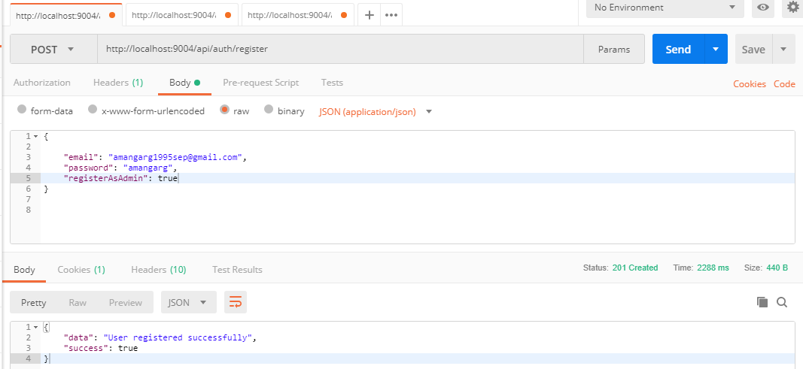
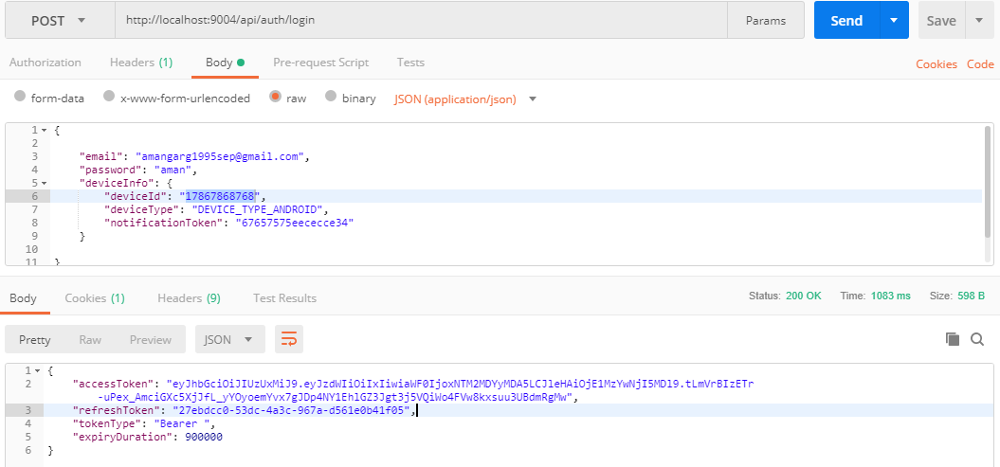
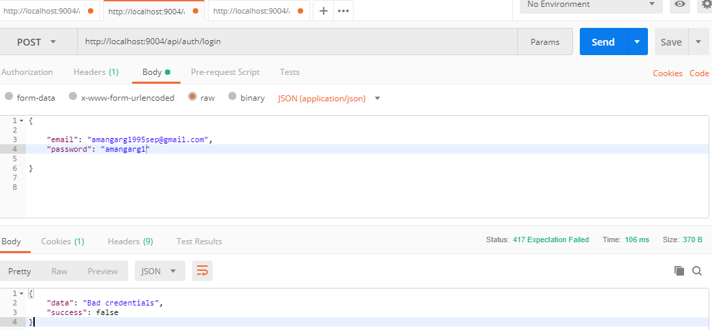
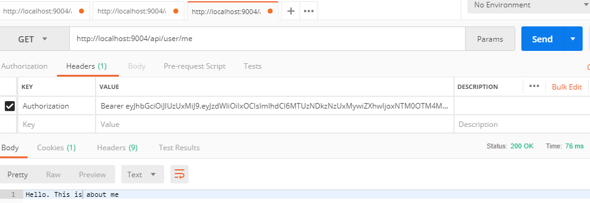
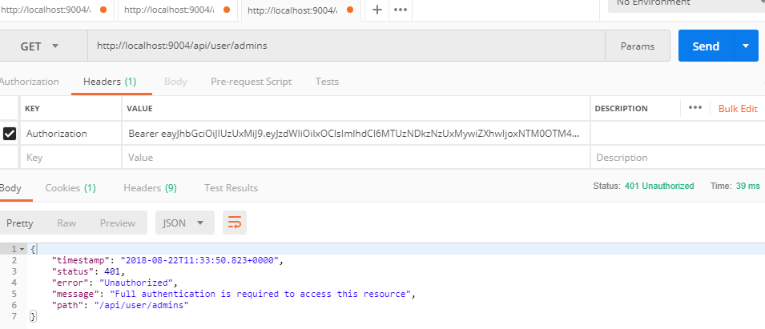
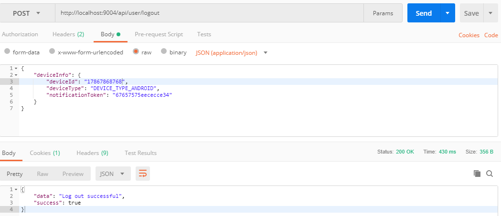
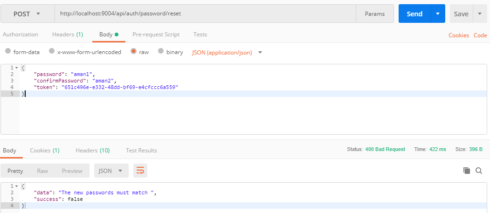

## Jwt-Spring-Security-JPA ##

<a href="https://sourcerer.io/isopropylcyanide"></a>

A demo project explaining the backend authentication using JWT (Json Web Token) authentication using Spring Security &amp; MySQL JPA.
There's support for the following features:

* Conventional email/username based registration with admin support
* Conventional Login using Spring Security and generation of JWT token
* Multiple device login and logout support
* Support for expiration bases email verification. Mail is sent upon registration. 
* Resend the email confirmation email if old one expires
* Support for password updation once logged in
* Support for forgot-password functionality with password reset token sent to mail.
* Supports admin protected urls leveraging Spring security
* API to refresh JWT tokens once the temporary JWT expires. 
* API to check availability of username/email during registration.


---

## Swagger Docs ##
The project has been configured with a basic Swagger docket that exposes the commonly used API's along with the expected params.


---

## JWT ##
JSON Web Tokens are an open, industry standard RFC 7519 method for representing claims securely between two parties.


## Exception Handling ##
The app throws custom exceptions wherever necessary which are captured through a controller advice. It then returns the appropriate error response to the caller
* AppException
* BadRequestException
* ResourceAlreadyInUseException
* ResourceNotFoundException
* UserLoginException
* UserRegistrationException
* MethodArgumentNotValidException
* UserLogoutException
* TokenRefreshException
* UpdatePasswordException
* PasswordResetException
* PasswordResetLinkException

Moreover, entities are validated using JSR-303 Validation constraints. 

---

## Steps to Setup the Spring Boot Back end app

1. **Clone the application**

	```bash
	git clone https://github.com/isopropylcyanide/Jwt-Spring-Security-JPA.git
	cd AuthApp
	```

2. **Create MySQL database**

	```bash
	create database login_db
	```

3. **Change MySQL username and password as per your MySQL installation**

	+ open `src/main/resources/application.properties` file.

	+ change `spring.datasource.username` and `spring.datasource.password` properties as per your mysql installation
	
	+ open `src/main/resources/mail.properties` file.

	+ change `spring.mail.username` and `spring.mail.password` properties as per your mail installation

4. **Run the app**

	You can run the spring boot app by typing the following command -

	```bash
	mvn spring-boot:run
	```

	The server will start on port 9004. Token default expiration is 600000ms i.e 10 minutes.
	```
5. **Add the default Roles**
	
	The spring boot app uses role based authorization powered by spring security. Please execute the following sql queries in the database to insert the `USER` and `ADMIN` roles.

	```sql
    INSERT INTO ROLE (ROLE_NAME) VALUES ('ROLE_USER');
    INSERT INTO ROLE (ROLE_NAME) VALUES ('ROLE_ADMIN');
	```

	Any new user who signs up to the app is assigned the `ROLE_USER` by default.

6. ** API DOC**

   http://localhost:9004/swagger-ui/index.html?configUrl=/v3/api-docs/swagger-config#/
   

---

### Contribution ###
* Please fork the project and adapt it to your use case.
* Submit a pull request.
* The project is in a nascent stage. As such any issues you find should be reported in the issues section.

---
## Demo Screens ##

1. **Registering a user**
---



2. **Logging in a valid user**
---


-----


3. **Logging in an invalid user**
---


3. **Using the token in request header & accessing resource**
---
Authorization



4. **Accessing admin resource with invalid permissions/token**
---


5. **Logging out the user device**
---


6. **Resetting the password**
---


7. **Refreshing the authentication token**
---
![image]./45047676-5bb5ee00-b097-11e8-84d4-2dbbe1489157.png)

8. **Confirming the user email verification token**
---


